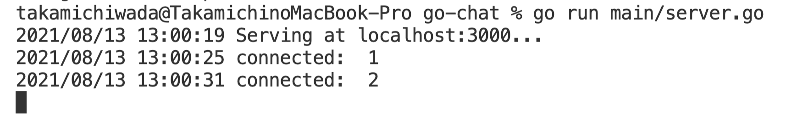
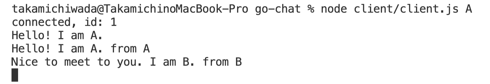
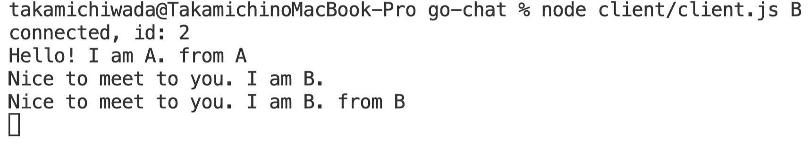

# simple-CLI-chat

CLIで使うシンプルなチャットアプリ

## 実行方法

1. サーバを起動する

   `go run main/server.go`

2. 別のターミナルを開いてクライアントAを起動する

   `node client/client.js A`

3. 別のターミナルを開いてクライアントBを起動する

   `node client/client.js B`

4. 標準入力が互いに送信される

    **server**
    
    **clientA**
    
    **clientB**
    

## 技術

### サーバ

- Golang
- socket.io
  - [Introduction \| Socket\.IO](https://socket.io/docs/v4/index.html)
  - [googollee/go\-socket\.io: socket\.io library for golang, a realtime application framework\.](https://github.com/googollee/go-socket.io)

### クライアント

- JavaScript
- socket.io

## 参考

- [Socket\.ioでコンソールベースのチャットを作ってみる \- Qiita](https://qiita.com/takehilo/items/dd64d999058cb1dd2c79)
- [go\-socket\.io/\_examples/default\-http at master · googollee/go\-socket\.io](https://github.com/googollee/go-socket.io/tree/master/_examples/default-http)

